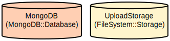

# E-commerce Chatbot with n8n Workflow

An e-commerce chatbot implementation using n8n workflow automation. The chatbot provides a conversational interface for customers to search products, track orders, place new orders, and get delivery information.

The chatbot workflow includes:
- Natural language processing for intent classification
- Integration with e-commerce APIs for data retrieval
- Conversational flow management for order processing

Key features include:
- Product catalog with search and filtering capabilities
- Guest and registered user checkout flows
- Real-time order tracking and delivery management
- Cloudinary integration for image management
- Intent-based conversation handling
- Context-aware responses
- MongoDB database integration
- OpenRouter Chat Model integration

## Repository Structure
```
├── admin/                  # Admin dashboard React application
│   ├── src/               # Source code directory
│   │   ├── components/    # Reusable UI components
│   │   ├── context/      # React context providers
│   │   ├── pages/        # Admin interface pages
│   │   └── services/     # API integration services
├── backend/               # Express.js backend application
│   ├── config/           # Configuration files
│   ├── controllers/      # Route controllers
│   ├── middleware/       # Custom middleware
│   ├── models/          # Mongoose data models
│   ├── routes/          # API route definitions
│   └── utils/           # Utility functions
├── chatbot/              # N8n workflow for e-commerce chatbot
│   └── n8n_workflow/    # N8n workflow definitions
├── docs/                 # Documentation files
│   ├── infra.dot        # Infrastructure diagram source
│   └── infra.svg        # Infrastructure diagram
└── frontend/             # Customer-facing React application
    ├── src/             # Source code directory
    │   ├── components/  # Reusable UI components
    │   ├── context/    # React context providers
    │   ├── pages/      # Frontend pages
    │   └── services/   # API integration services
```

## Usage Instructions
### Prerequisites
- n8n workflow automation platform

Required environment variables:
```
MONGODB_URI=your_mongodb_connection_string
JWT_SECRET=your_jwt_secret
CLOUDINARY_CLOUD_NAME=your_cloudinary_cloud_name
CLOUDINARY_API_KEY=your_cloudinary_api_key
CLOUDINARY_API_SECRET=your_cloudinary_api_secret
```

### Installation

1. Import the n8n workflow:
- Open your n8n instance
- Go to Workflows
- Click Import from File
- Select `chatbot/n8n_workflow/Ecommerce_Chatbot.json`

2. Configure the workflow:
- Set up the required credentials
- Configure the OpenRouter Chat Model node
- Update the API endpoints for your e-commerce system

3. Activate the workflow:
- Click "Active" to enable the workflow
- Test the chatbot with sample queries

### Chatbot Features

1. Product Search:
```bash
User: "I want to buy a laptop"
Bot: "I'll help you search for laptops. Here are some options..."
```

2. Order Tracking:
```bash
User: "Where is my order #12345?"
Bot: "Let me check that order for you..."
```

3. Place Order:
```bash
User: "I want to order this product"
Bot: "I'll help you place an order. First, let me get some details..."
```

### Troubleshooting

1. MongoDB Connection Issues
- Error: "MongoDB Connection Failed"
- Solution: 
  ```bash
  # Check MongoDB service status
  sudo service mongodb status
  
  # Verify connection string in .env file
  MONGODB_URI=mongodb://localhost:27017/your_database
  ```

2. Image Upload Issues
- Error: "Cloudinary configuration is missing"
- Solution: Verify Cloudinary credentials in .env file
- Check upload directory permissions:
  ```bash
  chmod 755 backend/uploads
  ```

## Data Flow
The application follows a standard client-server architecture with RESTful API communication.

```ascii
Chatbot   →   n8n Workflow   →   E-commerce API
   ↑              ↑                   ↑
   |              |                   |
   └── Intent ────┴── OpenRouter ─────┘
```

Workflow interactions:
1. User sends message to chatbot
2. n8n workflow processes the message
3. Intent is classified using OpenRouter
4. Appropriate API endpoints are called based on intent
5. Response is formatted and sent back to user

## Infrastructure



### Database
- MongoDB instance for data persistence
- Collections: users, products, orders, delivery_routes

### File Storage
- Cloudinary for image storage and optimization
- Local upload directory for temporary file storage

### API Server
- Express.js application serving REST endpoints
- JWT authentication middleware
- Error handling middleware
- CORS configuration for cross-origin requests